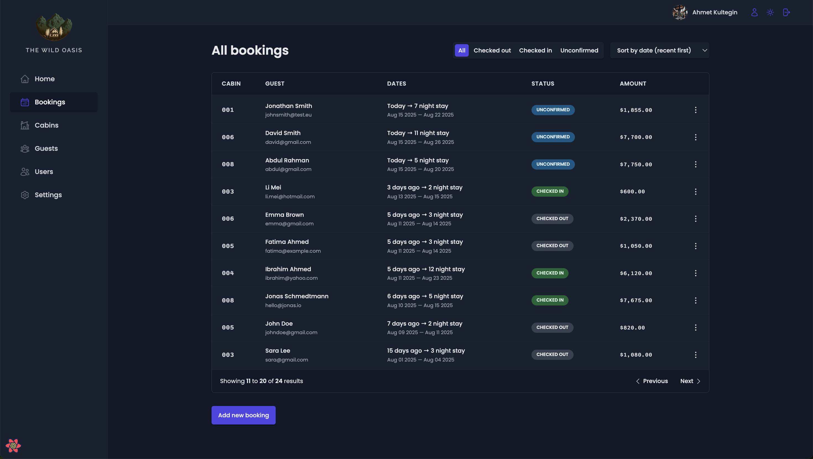

# The Wild Oasis

[](https://the-wild-oasis-mabedir.netlify.app/login)

A modern hotel operations dashboard built with React and Vite. Manage cabins, bookings, guests, and daily operations with an opinionated, production-ready frontend that integrates with Supabase for authentication, data storage, and policies.

## Live Demo

https://the-wild-oasis-mabedir.netlify.app/login

Quick test login:

- Email: test@test.com
- Password: 123123123

## How to Navigate

- Login: Use the credentials above on the login page.
- Dashboard: Overview of KPIs and recent activity.
- Bookings: Browse, filter, sort, paginate; open a booking for details or deletion.
- Cabins: Create, edit, delete cabins; upload images.
- Guests: Browse/search guests; view guest details.
- Users/Account: Update profile info and avatar; change password.
- Settings: Application preferences; includes dark mode toggle.
- Check-in/Check-out: Accessible from booking flows when applicable.

## Features

- Authentication: email/password, session handling, profile update, avatar upload
- Bookings: list, filter/sort/paginate, view details, create/delete
- Cabins: list, create, edit, delete, image upload
- Guests: list and search guests, view profiles
- Dashboard: KPIs, charts, recent activity
- Settings: app-wide preferences, dark mode
- UI/UX: accessible components, keyboard-friendly forms, toasts, modals, and loading states

## Tech Stack

- React 18 + Vite
- Styled Components
- React Router v6
- React Hook Form
- TanStack Query (React Query)
- Supabase (Auth, DB, Storage)
- date-fns, recharts, react-icons

## Test User (for reviewers)

Use the following credentials to sign in and explore the app:

- Email: test@test.com
- Password: 123123123

In the app, go to the Login page and enter the credentials above. You can log out from the user menu in the header.

## Getting Started

1. Prerequisites

- Node.js 18+ and npm
- A Supabase project (if running against your own backend)

2. Installation

- Clone the repository
- Install dependencies: `npm install`

3. Environment variables

- Create a `.env` file in the project root with the following keys:
  - `VITE_SUPABASE_URL=your_supabase_url`
  - `VITE_SUPABASE_ANON_KEY=your_supabase_anon_key`

4. Run the app

- Development: `npm run dev`
- Lint: `npm run lint`
- Production build: `npm run build` then `npm run preview`

## Scripts

- `npm run dev` — start Vite dev server
- `npm run build` — build for production
- `npm run preview` — preview the production build locally
- `npm run lint` — run ESLint

## Project Structure

```
src/
	features/           # domain features (auth, bookings, cabins, guests, dashboard, settings)
	pages/              # route-level pages
	services/           # Supabase client and API modules
	ui/                 # reusable UI components
	styles/             # global styles and theme
	utils/              # helpers and constants
	context/            # app-level contexts (e.g., dark mode)
```

## Security Notes

- The Supabase anon key is intended for client-side usage. Actual data access is governed by Row Level Security (RLS) policies in the database.
- Do not commit service role keys or any secrets. Use environment variables for configuration.

## Deployment

- The app can be deployed to Netlify, Vercel, or any static hosting that supports SPAs.
- Ensure the environment variables are configured in your hosting provider.

## Screenshots





## License

This project is provided as-is for learning and demonstration purposes.
